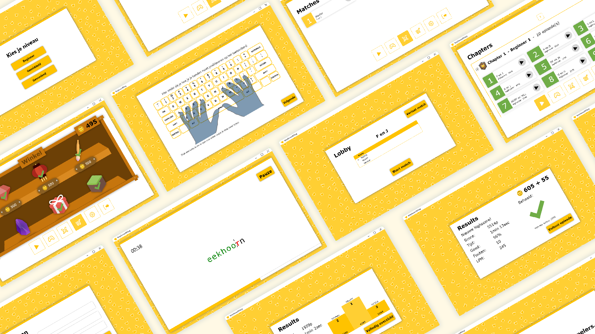
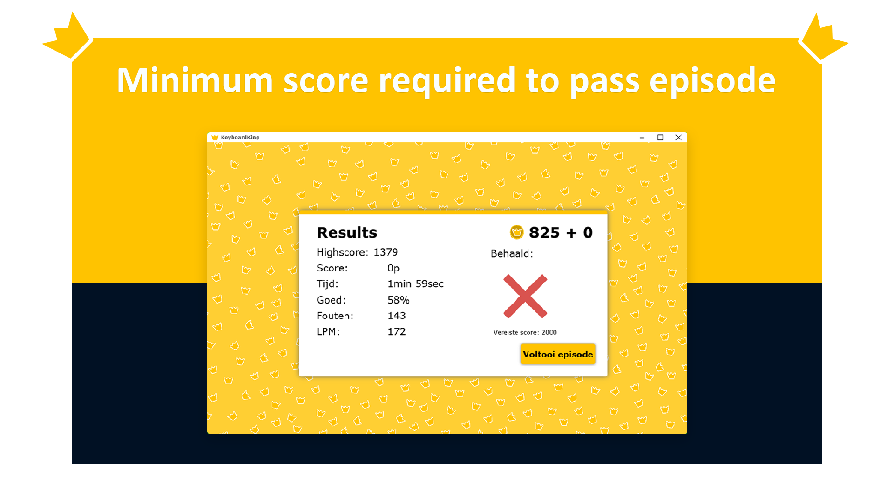
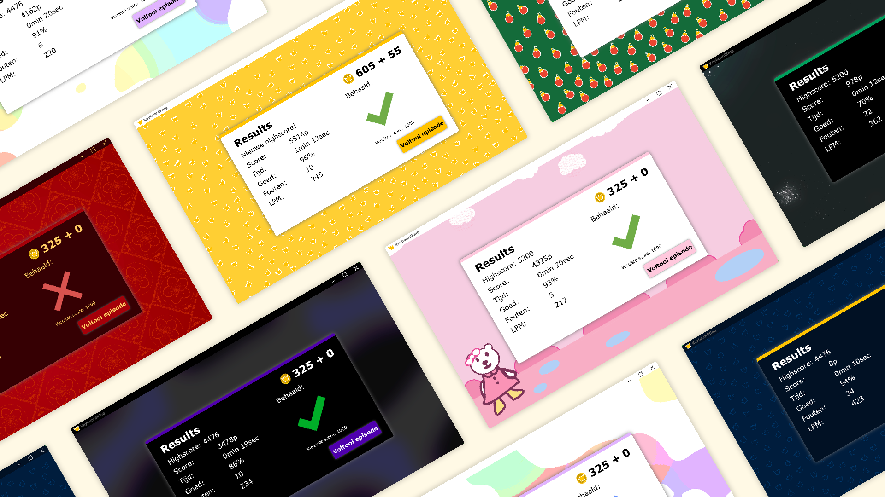
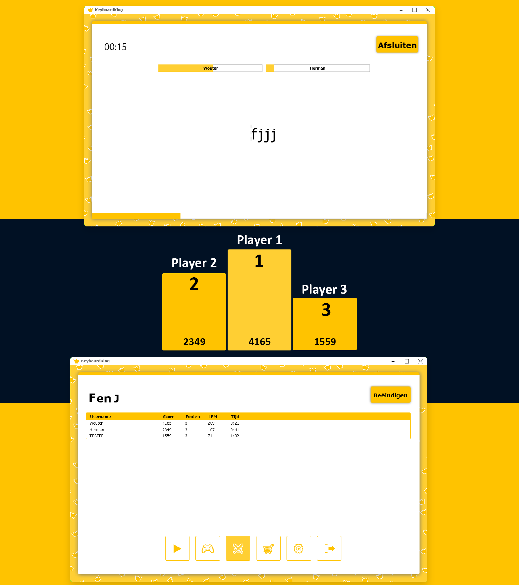

# 👑 KeyboardKing 👑
Learn to type fast and correct with KeyboardKing!  
This application was made for a school project in year 2 during the minor OOSDD on Windesheim HBO-ICT.

This application will teach you to type fast and flawlessly without looking at the keyboard.  
It doesn't matter if you're a beginner or advanced user, you'll find KeyboardKing will enhance your skills.

### A few things you can do in the application:

    🅰 Exercises with a few letters
    🧩 Exercises with words
    🧠 Exercises with sentences
    📈 Practice and beat your highscores
    🕹️ Different gamemodes
    🧑‍🤝‍🧑 Online multiplayer

In order to pass an episode you'll need to get a minimum amount of points. Didn't pass the first time? No worries! You can try again and beat your highscore.

# Shop 🛒
Playing episodes will earn you coins. These coins can be spend in the shop to require new themes. In the future the shop will be filled with even more content like more music 🎵.

# Themes 🖌️
There are plenty of themes to stand out from th croud. Using the coins you earn by playing episodes you can equip yourself with a whole arsenal of themes. Once you've unlocked them you can use them forever.

# Multiplayer 🥇🥈🥉

Bored of playing normal episodes? Take it up a notch by beating your friends!  
You'll be able to join or create a match with other people. While playing you can see the progress of others. This way you can keep an eye on your competition👀

